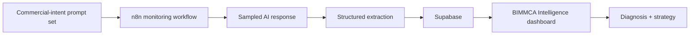

# BIMMCA Intelligence

**AI Authority Intelligence dashboard powered by VAREVANT.**

BIMMCA Intelligence is a public-safe monitoring and decision-support surface for sampled AI recommendation visibility, competitive authority, and strategic gaps.

The public application is connected to Supabase and is designed to consume structured data produced by a VAREVANT n8n monitoring workflow. This repository intentionally exposes the reviewable product/dashboard layer without publishing privileged credentials or confidential workflow logic.

## Technical reviewer quick start

If you are evaluating this repository as engineering proof, start here:

1. Read the architecture and evidence boundary below.
2. Inspect [`index.html`](index.html) for the public dashboard/application layer.
3. Review how the dashboard consumes Supabase-backed state rather than hard-coding a static report.
4. Note the explicit distinction between sampled AI responses and complete platform-wide visibility.
5. Run the project locally with a simple static server if you want to inspect the interface.

```bash
python -m http.server 8000
```

Then open `http://localhost:8000`.

## What the current dashboard shows

The public application includes:

- Executive Brief
- AI Authority metrics
- Competitive Landscape
- Strategic Gaps
- Strategy Center
- Evidence / source-state view

The current interface is configured around an Indonesia / women’s deodorant monitoring example and shows NIVEA alongside tracked competitors.

## Public engineering scope

The public repository demonstrates:

- a browser-based dashboard built with HTML, CSS, and JavaScript;
- Supabase-backed state consumption through the JavaScript client;
- separation between data collection/orchestration and the presentation layer;
- evidence-aware reporting instead of claiming complete visibility into every AI response;
- a clear public/private boundary around credentials and commercial logic.

The automation/orchestration layer itself is intentionally not fully published because it may contain operational logic, credentials, and private data boundaries that should not be exposed simply to make a portfolio look larger.

## Architecture



The dashboard code currently references:

- `brand_metrics_latest` — latest brand-level metrics
- `ai_responses` — sampled AI outputs
- `prompts` — active prompt set
- n8n schedule cadence described in the UI as every 30 minutes

## Measurement principle

The system measures a **sample** of AI responses. It does not claim access to private consumer conversations or to every answer produced by an AI platform.

That distinction is intentional.

A stronger trend requires:

- broader prompt coverage;
- repeated runs over time;
- consistent extraction rules;
- comparison against the same tracked brands and intent categories.

The dashboard is therefore a decision-support layer, not a claim of complete visibility into an AI provider’s total answer population.

## Reliability and safety boundaries

This public surface is designed around a few explicit boundaries:

- privileged database/service-role credentials are not published;
- private n8n credentials are not published;
- client-private source material is not published;
- the dashboard does not claim universal AI-platform coverage;
- public evidence is limited to what can be shown safely and verified from the repository.

A publishable client-side key is not a substitute for database authorization. Privileged keys and administrative access must remain private.

## Technology

Current public layer:

- HTML / CSS / JavaScript
- Supabase JavaScript client
- Supabase-backed live metrics
- n8n monitoring/orchestration outside this public repository

## Repository map

```text
.
├── README.md       # Technical overview and evidence boundaries
├── index.html      # Public dashboard/application layer
└── netlify.toml    # Static deployment configuration
```

## Why the automation itself is not fully public

The purpose of this repository is to make the product surface and public-safe system design reviewable without leaking operational credentials or private commercial logic.

For technical review, the important architecture boundary is:

1. prompts are defined;
2. n8n runs the monitoring process;
3. responses are sampled and structured;
4. Supabase stores the resulting state;
5. the dashboard turns that state into an operating view;
6. strategy is treated as a hypothesis to validate against accumulating evidence.

## Evidence boundary

This repository is proof of the dashboard/application layer and its public-safe architecture. It should not be used to infer unverified client revenue results, universal AI-platform coverage, or access to private model conversations.

## Related engineering work

- [VAREVANT technical repository](https://github.com/naraya07pedro-spec/varevant.com)
- [varevant.com](https://varevant.com)
- [LinkedIn — Evan Naraya](https://www.linkedin.com/in/evannaraya)

## Contact

**Evan Naraya — VAREVANT**  
[evan@varevant.com](mailto:evan@varevant.com)
