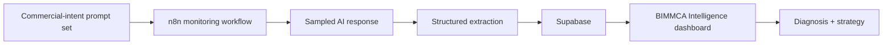

# BIMMCA Intelligence

**AI Authority Intelligence dashboard powered by VAREVANT.**

This repository contains the public client-facing dashboard layer for monitoring sampled AI recommendation visibility, competitive authority, and strategic gaps.

The dashboard is connected to Supabase and is designed to consume data produced by a VAREVANT n8n monitoring workflow.

## What the current dashboard shows

The public application includes:

- Executive Brief
- AI Authority metrics
- Competitive Landscape
- Strategic Gaps
- Strategy Center
- Evidence / source-state view

The current interface is configured around an Indonesia / women’s deodorant monitoring example and shows NIVEA alongside tracked competitors.

## Architecture

The dashboard code currently references:

- `brand_metrics_latest` — latest brand-level metrics
- `ai_responses` — sampled AI outputs
- `prompts` — active prompt set
- n8n schedule cadence described in the UI as every 30 minutes

## Measurement principle

The system measures a **sample** of AI responses. It does not claim access to private consumer conversations or to every answer produced by an AI platform.

That distinction is intentional.

A stronger trend requires:

- broader prompt coverage;
- repeated runs over time;
- consistent extraction rules;
- comparison against the same tracked brands and intent categories.

The dashboard is therefore a decision-support layer, not a claim of complete visibility into an AI provider’s total answer population.

## Technology

Current public layer:

- HTML / CSS / JavaScript
- Supabase JavaScript client
- Supabase-backed live metrics
- n8n monitoring/orchestration outside this public repository

## Public / private boundary

This repository intentionally does **not** publish:

- service-role database credentials;
- private n8n credentials;
- confidential client source material;
- private raw data that should not be exposed;
- administration access to the backend.

The client-side application may contain a platform-defined **publishable** key. A publishable key is not a substitute for correct database authorization; privileged keys and administrative access must remain private.

## Why the automation itself is not fully public

The purpose of this repository is to make the product surface and public-safe system design reviewable without leaking operational credentials or private commercial logic.

For technical review, the important architecture boundary is:

1. prompts are defined;
2. n8n runs the monitoring process;
3. responses are sampled and structured;
4. Supabase stores the resulting state;
5. the dashboard turns that state into an operating view;
6. strategy is treated as a hypothesis to validate against accumulating evidence.

## Evidence boundary

This repository is proof of the dashboard/application layer and its public-safe architecture. It should not be used to infer unverified client revenue results, universal AI-platform coverage, or access to private model conversations.

## VAREVANT

Technical execution: automation, backend systems, integrations, and bounded AI-agent workflows.

- [varevant.com](https://varevant.com)
- [VAREVANT technical repository](https://github.com/naraya07pedro-spec/varevant.com)
- [evan@varevant.com](mailto:evan@varevant.com)