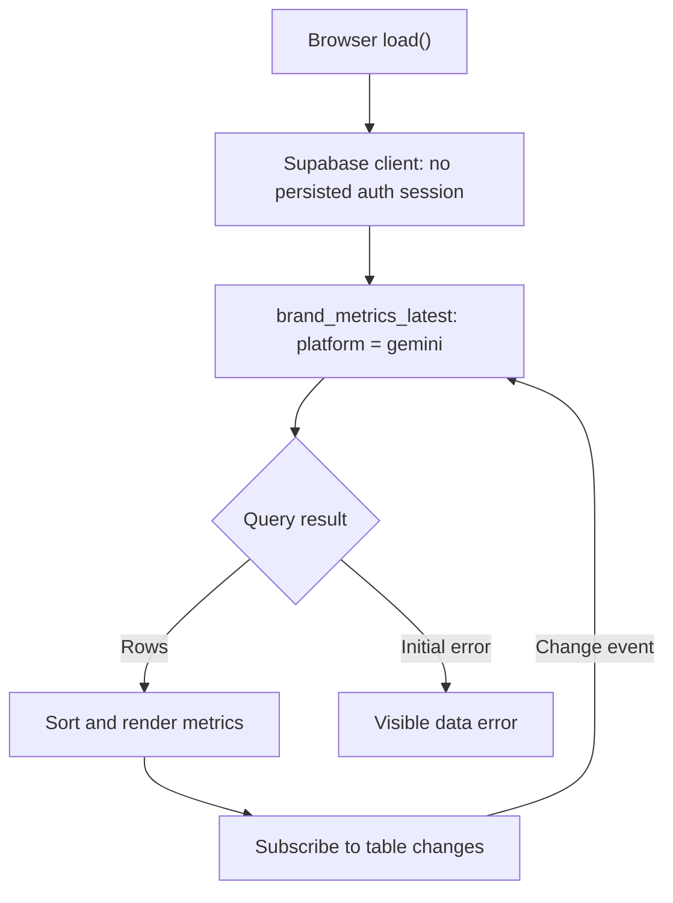

# Browser architecture and data contract

This document describes the JavaScript in [`index.html`](../index.html). It does not reconstruct a private backend.

## Source-backed flow

After the initial query, the code registers a `postgres_changes` callback for all events on `public.brand_metrics_latest`. The callback refetches the entire Gemini subset. It does not apply change payloads directly. Query filtering is not an authorization boundary; backend access policies are outside this repository.

The application is a static HTML/CSS/JavaScript page. The Supabase client is loaded from a CDN. There is no server application, bundler, database migration, or published ingestion worker here. The described upstream n8n → AI → extraction → database flow cannot be verified from this source alone.

## Consumer contract, not a database schema

The fields below are derived from query and rendering expressions. Their PostgreSQL types, nullability, uniqueness, constraints, calculation methods, and RLS policies are **UNKNOWN**.

| Field | Consumer use | Expected input for rendering |
| --- | --- | --- |
| `platform` | Query equality filter | `gemini` |
| `brand` | Label, colour lookup, focal-brand lookup | Text; `NIVEA` identifies the focal brand |
| `visibility_score` | Descending rank, display, bar width | Numeric or numeric string; bar width clamped to 0–100 |
| `share_of_voice` | Percentage display | Numeric or numeric string |
| `avg_position` | Position display | Numeric or numeric string |
| `top1_rate` | Percentage display | Numeric or numeric string |
| `recommendation_rate` | Table percentage display | Numeric or numeric string |
| `positive_sentiment` | Percentage display | Numeric or numeric string |
| `updated_at` | Latest timestamp selected by string sorting | Consistent sortable timestamp strings are assumed |

[`brand-metrics.json`](../tests/fixtures/brand-metrics.json) is a small synthetic query-result example. It is not a database export or evidence of monitoring results. No SQL is supplied because the source does not establish a deployable schema or authorization model.

## Tests and practical limits

[`dashboard.test.mjs`](../tests/dashboard.test.mjs) executes the actual inline script with local doubles for the DOM and Supabase. Tests cover the query contract, no persisted auth session, sorting, metric/bar rendering, change-triggered refetch, and visible initial failure. They also record empty-result and refetch-error behavior. No real database or browser session is involved.

| Situation | Current source behavior | Review implication |
| --- | --- | --- |
| Initial query fails | Error status and explanatory text | Failure is visible |
| Empty result | `render()` returns immediately | Previous UI can remain; an empty state is not implemented |
| Realtime refetch fails | Result is ignored | No explicit stale-data warning or retry |
| Subscription reports `SUBSCRIBED` | Status becomes `LIVE` | Subscription state is not proof of fresh or correct metrics |
| Focal brand absent | `findIndex() + 1` yields zero | A `#0` rank can be displayed |
| Missing/nonnumeric metric | JavaScript number conversion | `null` becomes zero; invalid text becomes an em dash |
| Concurrent change events | Each starts a full refetch | Ordering and backpressure are not explicitly controlled |

No production runtime behavior was changed by the documentation/test hardening. Correct metric definitions, upstream ingestion, empty/stale-state handling, backend access policy review, and real browser/database integration checks remain separate work.
